<div align="center">

<!-- ============================================================ -->
<!--              💀 GAAND FAT HEADER BEGINS 💀                  -->
<!-- ============================================================ -->

<!-- 🌊 ANIMATED CYLINDER WAVE HEADER — FULL WIDTH -->


<br/>

<!-- 🐍 GITHUB CONTRIBUTION SNAKE — ANIMATED SVG -->
<picture>
  <source media="(prefers-color-scheme: dark)"  srcset="https://raw.githubusercontent.com/platane/snk/output/github-contribution-grid-snake-dark.svg"/>
  <source media="(prefers-color-scheme: light)" srcset="https://raw.githubusercontent.com/platane/snk/output/github-contribution-grid-snake.svg"/>
  
</picture>

<br/>

<!-- ⌨️ TYPING LINE 1 — MEGA IDENTITY -->
[](https://git.io/typing-svg)

<!-- ⌨️ TYPING LINE 2 — LIVE SQL COMMANDS -->
[](https://git.io/typing-svg)

<!-- ⌨️ TYPING LINE 3 — HYPE LINE -->
[](https://git.io/typing-svg)

<br/>

<!-- 🏅 BADGE ROW 1 — IDENTITY -->


<!-- 🏅 BADGE ROW 2 — STATS -->


<br/>

<!-- 🏅 BADGE ROW 3 — LIVE GITHUB -->
[](https://github.com/ashish-srivastava-tech)
[](https://github.com/ashish-srivastava-tech/DBMS-SQL-LAB)
[](https://github.com/ashish-srivastava-tech/DBMS-SQL-LAB)
[](https://github.com/ashish-srivastava-tech/DBMS-SQL-LAB)

<br/>

<!-- 🎯 ANIMATED SKILL ICONS — HOVERABLE -->
[](https://skillicons.dev)

<br/>

<!-- 📊 GITHUB STATS — 3 CARDS -->


<br/>

<!-- 🔥 STREAK STATS — ANIMATED COUNTER -->


<br/>

<!-- 🏆 TROPHY ROW -->


<br/>

<!-- 📈 ANIMATED CONTRIBUTION ACTIVITY GRAPH -->


<br/>

🏛️ **B.P. Mandal College of Engineering, Madhepura, Bihar**
`Batch 2023–27` · `Session 2025–26` · `Subject: DBMS Lab`

<!-- ============================================================ -->
<!--              💀 GAAND FAT HEADER ENDS 💀                    -->
<!-- ============================================================ -->

</div>

<!-- ===================== ANIMATED FIRE DIVIDER ===================== -->


## 📑 Table of Contents

<details open>
<summary><b>📋 Click to expand</b></summary>
<br/>

| 🔢 | 📌 Section | 🔢 | 📌 Section |
|:--:|:-----------|:--:|:-----------|
| 01 | [👨‍💻 About Me](#-about-me) | 07 | [📐 Database Schema](#-database-schema) |
| 02 | [🎯 What Is This Repo?](#-what-is-this-repo) | 08 | [🛠 Tech Stack](#-tech-stack) |
| 03 | [📊 Lab Dashboard](#-lab-dashboard) | 09 | [⚡ Oracle vs MySQL](#-oracle-vs-mysql-cheatsheet) |
| 04 | [🗂 Folder Structure](#-folder-structure) | 10 | [🧠 Skills Unlocked](#-skills-unlocked) |
| 05 | [🔬 Labs Deep Dive](#-labs-deep-dive) | 11 | [🚀 Roadmap](#-roadmap) |
| 06 | [🗄️ Real Data Used](#️-real-data-used) | 12 | [💡 How to Run](#-how-to-run) |

</details>


## 👨‍💻 About Me

<div align="center">

<!-- ANIMATED SECTION HEADER -->


<br/>

<!-- ANIMATED CODING GIF -->


</div>

```
╔══════════════════════════════════════════════════════════════╗
║                   🎓 STUDENT PROFILE                         ║
╠══════════════════════════════════════════════════════════════╣
║  Name        :  Ashish Srivastava                            ║
║  Program     :  B.Tech – Computer Science & Engineering      ║
║  Institution :  B.P. Mandal College of Engineering           ║
║  Location    :  Madhepura, Bihar, India                      ║
║  Semester    :  5th  |  Session 2025–26                      ║
║  Subject     :  Database Management Systems Lab              ║
║  Tool        :  Oracle SQL Developer / SQL*Plus              ║
║  GitHub      :  github.com/ashish-srivastava-tech            ║
╚══════════════════════════════════════════════════════════════╝
```

<div align="center">
<br clear="right"/>

<!-- ANIMATED GITHUB STATS — 3 CARDS SIDE BY SIDE -->


<br/>

<!-- ANIMATED STREAK STATS -->


<br/>

<!-- ANIMATED TROPHY -->


<br/>

<!-- ANIMATED ACTIVITY GRAPH -->


</div>


## 🎯 What Is This Repo?

<div align="center">

</div>

<details open>
<summary><b>📖 The full story — why this repo is different</b></summary>
<br/>

| 🔴 Average Student | 🟢 This Repository |
|:-------------------|:-------------------|
| Random / fake data | ✅ Real BPMCE faculty, courses & student records |
| No output proof | ✅ 38 CSV files — every single query verified |
| One big messy `.sql` file | ✅ Structured lab-wise with consistent folders |
| MySQL syntax | ✅ Pure Oracle SQL — `FETCH FIRST`, `VARCHAR2`, `SYSDATE` |
| No documentation | ✅ Every lab has its own detailed README |
| Submitted and forgotten | ✅ Actively maintained, more labs coming |

</details>


## 📊 Lab Dashboard

<div align="center">

<!-- TYPING ANIMATION FOR THIS SECTION -->
[](https://git.io/typing-svg)

<br/>

<!-- STATUS BADGES PER LAB -->


</div>

<br/>

| # | Lab Title | Queries | CSV Outputs | Status |
|:--:|:---------|:-------:|:-----------:|:------:|
| `01` | **DDL & DML Operations** | 18 | — | ✅ Complete |
| `02` | **ER Model & Relational Schema** | 5 tables | ER Diagram | ✅ Complete |
| `03` | **Real Database Implementation** | 50+ INSERTs | 5 CSVs | ✅ Complete |
| `04` | **Data Retrieval (SELECT)** | 23 | 18 CSVs | ✅ Complete |
| `05` | **INNER JOIN Queries** | 20 | 20 CSVs | ✅ Complete |
| `06` | **GROUP BY & HAVING** | 22 | — | ✅ Complete |
| `07` | **Subqueries** | — | — | 🔜 Upcoming |
| `08` | **OUTER JOIN** | — | — | 🔜 Upcoming |

<details>
<summary><b>📈 Full Repository Stats</b></summary>
<br/>

```
╔══════════════════════════════════════╗
║        REPOSITORY STATISTICS         ║
╠══════════════════════════════════════╣
║  Total SQL Queries      :   133+     ║
║  Total Lines of Code    :   500+     ║
║  CSV Output Files       :   38       ║
║  Labs Completed         :   6        ║
║  Database Tables        :   5        ║
║  Total Data Records     :   150+     ║
║  Real Faculty Entries   :   26       ║
║  Real Student Entries   :   10       ║
║  Departments Covered    :   7        ║
║  Courses in DB          :   32       ║
║  Enrollment Records     :   50       ║
╚══════════════════════════════════════╝
```

</details>


## 🗂 Folder Structure

<details open>
<summary><b>📁 Complete Repository Tree</b></summary>

```
📦 DBMS-SQL-LAB/
│
├── 📁 Lab-01-DDL-DML/
│   ├── 📄 lab1_solution.sql          ← 18 DDL + DML queries
│   ├── 📄 questions.pdf
│   └── 📄 README.md
│
├── 📁 Lab-02-ER-Diagram/
│   ├── 📄 Lab_02_Tables.sql          ← 5 CREATE TABLE + constraints
│   ├── 🖼️  ER_Diagram_Lab_02.png     ← ER diagram (viewable on GitHub)
│   ├── 📐 ER_Diagram_Lab_02.drawio   ← Editable draw.io source
│   ├── 📄 questions.pdf
│   └── 📄 README.md
│
├── 📁 Lab-03-ER-Relation/
│   ├── 📁 SQL/
│   │   └── 📄 Lab_03_Solution.sql    ← 50+ INSERTs with real BPMCE data
│   ├── 📁 Data_Files/
│   │   ├── 📊 Student_data.csv
│   │   ├── 📊 Faculty_data.csv
│   │   ├── 📊 Course_data.csv
│   │   ├── 📊 Department_data.csv
│   │   └── 📊 Enrollment_data.csv
│   ├── 📁 Questions/
│   ├── 📁 Reference_Material/        ← 5th, 7th sem timetables
│   └── 📄 README.md
│
├── 📁 Lab-04-Data-Retrieval/
│   ├── 📄 Lab_04_Solution.sql        ← 23 SELECT queries
│   ├── 📁 CSV/                       ← 18 verified outputs (A → R)
│   ├── 📄 Lab_04_Questions.pdf
│   └── 📄 README.md
│
├── 📁 Lab-05-Joins/
│   ├── 📄 Lab_05_solution.sql        ← 20 INNER JOIN queries
│   ├── 📁 CSV/                       ← 20 verified outputs (A → T)
│   ├── 📄 DB-Lab-5_Question.pdf
│   └── 📄 README.md
│
├── 📁 Lab-06-Data-Aggregation/
│   ├── 📄 Lab_06_Solution.sql        ← 22 GROUP BY + HAVING queries
│   ├── 📄 DB-Lab-6.pdf
│   └── 📄 README.md
│
└── 📄 README.md                      ← 👈 You are here
```

</details>


## 🔬 Labs Deep Dive

<div align="center">


[](https://git.io/typing-svg)
</div>

<br/>

<details open>
<summary><b>🔹 Lab 01 – DDL & DML Operations</b></summary>
<br/>

> 🎯 **Objective:** Master the building blocks of SQL — define, modify, and manipulate tables.

```sql
CREATE TABLE Student (RollNo NUMBER PRIMARY KEY, Name VARCHAR2(50), ...);
ALTER TABLE Student ADD City VARCHAR2(30);
ALTER TABLE Student RENAME COLUMN Phone TO MobileNo;
INSERT INTO Student VALUES (101, 'Rahul', 'CSE', 20, '9876543210', 'Delhi', 3);
UPDATE Student SET Age = Age + 1;   -- Birthday for everyone 🎂
DELETE FROM Student WHERE RollNo = 105;
```

</details>

---

<details>
<summary><b>🔹 Lab 02 – ER Model & Relational Schema</b></summary>
<br/>

> 🎯 **Objective:** Design a full college ER diagram and implement it as Oracle SQL tables.

```
Department ──(1:M)── Student
Department ──(1:M)── Faculty
Department ──(1:M)── Course
Faculty    ──(1:M)── Course
Student    ──(M:N)── Course  ──► Resolved via ENROLLMENT junction table
```

```sql
CREATE TABLE Enrollment (
    StudentID  NUMBER,
    CourseID   NUMBER,
    Semester   NUMBER,
    Grade      VARCHAR2(5),
    CONSTRAINT pk_enrollment PRIMARY KEY (StudentID, CourseID),
    CONSTRAINT fk_stu FOREIGN KEY (StudentID) REFERENCES Student(StudentID),
    CONSTRAINT fk_crs FOREIGN KEY (CourseID)  REFERENCES Course(CourseID)
);
```

</details>

---

<details>
<summary><b>🔹 Lab 03 – Real Database Implementation</b></summary>
<br/>

> 🎯 **Objective:** Insert real B.P. Mandal College of Engineering data — zero fake values.

```sql
-- Actual BPMCE faculty:
INSERT INTO Faculty VALUES (518, 'E. Haque',   'Associate Professor', 'ehtasham47@gmail.com',  105);
INSERT INTO Faculty VALUES (519, 'Md. Izhar',  'Associate Professor', 'mdizhar1996@gmail.com', 105);

-- Actual 5th sem CSE courses:
INSERT INTO Course VALUES (105501, 'Artificial Intelligence',     4, 105, 518);
INSERT INTO Course VALUES (105502, 'Database Management Systems', 4, 105, 519);
```

</details>

---

<details>
<summary><b>🔹 Lab 04 – Data Retrieval (23 Queries)</b></summary>
<br/>

> 🎯 **Objective:** Master SELECT — aliases, filtering, sorting, limiting, derived columns.

```sql
-- Oracle-specific functions (not in MySQL):
SELECT Name, FLOOR(MONTHS_BETWEEN(SYSDATE, DateOfBirth) / 12) AS Age FROM Student;
SELECT Name, EXTRACT(YEAR FROM DateOfBirth) AS Birth_Year FROM Student;
SELECT Name, SUBSTR(Email, INSTR(Email, '@') + 1) AS Email_Domain FROM Faculty;
SELECT * FROM Student FETCH FIRST 3 ROWS ONLY;
```

</details>

---

<details>
<summary><b>🔹 Lab 05 – INNER JOIN (20 Queries)</b></summary>
<br/>

> 🎯 **Objective:** Pull combined data from 2 and 3 related tables using INNER JOIN.

```sql
SELECT S.Name, C.CourseName, E.Grade
FROM   Student    S
INNER JOIN Enrollment E ON S.StudentID = E.StudentID
INNER JOIN Course     C ON E.CourseID  = C.CourseID
WHERE  E.Semester = 5
ORDER BY S.Name ASC;
```

</details>

---

<details>
<summary><b>🔹 Lab 06 – GROUP BY & HAVING (22 Queries)</b></summary>
<br/>

> 🎯 **Objective:** Aggregate and group data to generate real analytical reports.

```sql
-- WHERE  → filters rows   (before grouping)
-- HAVING → filters groups (after  grouping)

SELECT C.CourseName, COUNT(E.StudentID) AS Total_Students
FROM   Course      C
INNER JOIN Enrollment E ON C.CourseID = E.CourseID
GROUP BY C.CourseName
HAVING COUNT(E.StudentID) > 2
ORDER BY Total_Students DESC;
```

</details>


## 🗄️ Real Data Used

<div align="center">


[](https://git.io/typing-svg)
</div>

<br/>

| Entity | Count | Source |
|:-------|:-----:|:-------|
| 🏢 Departments | 7 | BPMCE official website |
| 👨‍🏫 Faculty | 26 | Department pages + timetable |
| 👨‍🎓 Students | 10 | CSE Batch 2023 roll list |
| 📚 Courses | 32 | 5th Semester syllabus |
| 📋 Enrollments | 50 | Academic structure |


## 📐 Database Schema

<div align="center">

```
                    ┌──────────────────────┐
                    │      DEPARTMENT       │
                    │──────────────────────│
                    │ PK  DepartmentID      │
                    │     DepartmentName    │
                    │     OfficeLocation    │
                    └──────────┬───────────┘
                               │ 1
              ┌────────────────┼──────────────────┐
              │ M              │ M                 │ M
              ▼                ▼                   ▼
   ┌────────────────┐ ┌──────────────────┐ ┌──────────────────┐
   │    STUDENT     │ │     FACULTY      │ │     COURSE       │
   │────────────────│ │──────────────────│ │──────────────────│
   │ PK StudentID   │ │ PK FacultyID     │◄│ PK CourseID      │
   │    Name        │ │    Name          │ │    CourseName    │
   │    DateOfBirth │ │    Designation   │ │    Credits       │
   │    Gender      │ │    Email         │ │ FK DeptID        │
   │    Contact     │ │ FK DeptID        │ │ FK FacultyID     │
   │ FK DeptID      │ └──────────────────┘ └──────────────────┘
   └────────┬───────┘                               │
            │ M                                     │ M
            └──────────────────┬────────────────────┘
                               ▼
                  ┌────────────────────────┐
                  │       ENROLLMENT        │
                  │────────────────────────│
                  │ PK FK  StudentID        │
                  │ PK FK  CourseID         │
                  │        Semester         │
                  │        Grade            │
                  └────────────────────────┘
```

</div>


## 🛠 Tech Stack

<div align="center">

<!-- ANIMATED SKILL ICONS ROW -->
[](https://skillicons.dev)

<br/>


</div>


## ⚡ Oracle vs MySQL Cheatsheet

<div align="center">

[](https://git.io/typing-svg)

</div>

<br/>

| Feature | ❌ MySQL | ✅ Oracle (Used Here) |
|:--------|:---------|:----------------------|
| Limit rows | `LIMIT 5` | `FETCH FIRST 5 ROWS ONLY` |
| Current date | `NOW()` | `SYSDATE` |
| String type | `VARCHAR` | `VARCHAR2` |
| Age calc | `DATEDIFF()` | `MONTHS_BETWEEN()` |
| Create DB | `CREATE DATABASE` | ❌ Schema-based only |
| Extract year | `YEAR(col)` | `EXTRACT(YEAR FROM col)` |
| Email domain | `SUBSTRING_INDEX()` | `SUBSTR()` + `INSTR()` |
| Concat | `CONCAT(a,b)` | `a \|\| b` |


## 🧠 Skills Unlocked

<div align="center">

```
╔══════════════════╦══════════════════════════════════════════════════╗
║    CATEGORY      ║  SKILLS                                          ║
╠══════════════════╬══════════════════════════════════════════════════╣
║  DDL             ║  CREATE · ALTER · DROP · RENAME · TRUNCATE       ║
║  DML             ║  INSERT · UPDATE · DELETE · SELECT               ║
║  Constraints     ║  PRIMARY KEY · FOREIGN KEY · NOT NULL · UNIQUE   ║
║  Filtering       ║  WHERE · AND · OR · IN · BETWEEN · LIKE          ║
║  Sorting         ║  ORDER BY ASC/DESC · FETCH FIRST n ROWS ONLY     ║
║  Functions       ║  MONTHS_BETWEEN · EXTRACT · SUBSTR · INSTR       ║
║                  ║  FLOOR · SYSDATE · COUNT · MAX · MIN · AVG       ║
║  Joins           ║  INNER JOIN (2-table & 3-table)                  ║
║  Aggregation     ║  GROUP BY · HAVING · COUNT · MAX · MIN           ║
║  Schema Design   ║  ER Modeling · Normalization · Relational Schema  ║
╚══════════════════╩══════════════════════════════════════════════════╝
```

</div>


## 🚀 Roadmap

```mermaid
graph LR
    A([✅ Lab 01\nDDL & DML]) --> B([✅ Lab 02\nER Model])
    B --> C([✅ Lab 03\nData Insert])
    C --> D([✅ Lab 04\nSELECT])
    D --> E([✅ Lab 05\nINNER JOIN])
    E --> F([✅ Lab 06\nGROUP BY])
    F --> G([🔜 Lab 07\nSubqueries])
    G --> H([🔜 Lab 08\nOUTER JOIN])
    H --> I([🔜 Lab 09\nViews])
    I --> J([🔜 Lab 10\nPL/SQL])
    J --> K([🔜 Lab 11\nProcedures])
    K --> L([🔜 Lab 12\nTriggers])
```

<div align="center">

[](https://git.io/typing-svg)

</div>



- [ ] 🔜 Subqueries & Nested SELECT
- [ ] 🔜 OUTER JOIN (LEFT, RIGHT, FULL)
- [ ] 🔜 Views & Virtual Tables
- [ ] 🔜 Indexing & Query Optimization
- [ ] 🔜 PL/SQL Basics
- [ ] 🔜 Stored Procedures & Functions
- [ ] 🔜 Triggers & Cursors
- [ ] 🔜 Transactions & ACID Properties


## 💡 How to Run

<details open>
<summary><b>🚀 Step-by-Step Guide</b></summary>
<br/>

**Step 1 — Clone**
```bash
git clone https://github.com/ashish-srivastava-tech/DBMS-SQL-LAB.git
cd DBMS-SQL-LAB
```

**Step 2 — Open Oracle SQL Developer, connect to your schema**

**Step 3 — Run in this exact order ⚠️**
```
1️⃣  Lab-02 → Lab_02_Tables.sql      ← creates all 5 tables + constraints
2️⃣  Lab-03 → Lab_03_Solution.sql    ← inserts 150+ real records
3️⃣  Lab-04 → Lab_04_Solution.sql    ← 23 SELECT queries
4️⃣  Lab-05 → Lab_05_solution.sql    ← 20 INNER JOIN queries
5️⃣  Lab-06 → Lab_06_Solution.sql    ← 22 GROUP BY & HAVING queries
```

| Key | Action |
|:----|:-------|
| `F5` | Run full script |
| `F9` | Run single query |
| `Ctrl + Enter` | Run at cursor |
| `Ctrl + Shift + F` | Format / beautify SQL |

</details>

<!-- ===================== ANIMATED FOOTER ===================== -->


<div align="center">


[](https://git.io/typing-svg)

<br/>


```sql
SELECT 'Thank You for Visiting!'  AS Message,
       'Ashish Srivastava'        AS Author,
       'BPMCE Madhepura'          AS Institution,
       SYSDATE                    AS Timestamp
FROM   DUAL;
```

<br/>

**Made with ❤️ by Ashish Srivastava**
*B.P. Mandal College of Engineering, Madhepura, Bihar*

*📚 Structured · ⚡ Oracle-Native · 🎯 Real Data · 🔥 No Shortcuts*

</div>
