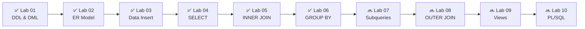

<div align="center">


<br/>

[;UPDATE+career+SET+level+%3D+level+%2B+1;COMMIT%3B)](https://git.io/typing-svg)

<br/>


<br/>

[](https://github.com/ashish-srivastava-tech)
[](https://github.com/ashish-srivastava-tech/DBMS-SQL-LAB)
[](https://github.com/ashish-srivastava-tech/DBMS-SQL-LAB)


</div>


<div align="center">

## 🏛️ B.P. Mandal College of Engineering, Madhepura, Bihar

</div>


<br/>

##  Table of Contents

<details open>
<summary><b>📋 Click to expand / collapse</b></summary>
<br/>

| # | Section |
|:-:|:--------|
| 01 | [👨‍🎓 Student Information](#-student-information) |
| 02 | [🎯 Repository Overview](#-repository-overview) |
| 03 | [📊 Lab Progress Dashboard](#-lab-progress-dashboard) |
| 04 | [🗂 Repository Structure](#-repository-structure) |
| 05 | [🔬 Labs in Detail](#-labs-in-detail) |
| 06 | [📐 Database Schema](#-database-schema) |
| 07 | [🛠 Tech Stack](#-tech-stack) |
| 08 | [🧠 Skills & Concepts](#-skills--concepts) |
| 09 | [⚠️ Oracle vs MySQL](#️-oracle-vs-mysql) |
| 10 | [🚀 Roadmap & Future Work](#-roadmap--future-work) |
| 11 | [💡 How to Use](#-how-to-use) |

</details>

<br/>


## 👨‍🎓 Student Information

<div align="center">

```
╔══════════════════════════════════════════════════════════════╗
║                   🎓 STUDENT PROFILE                         ║
╠══════════════════════════════════════════════════════════════╣
║  Name        :  Ashish Srivastava                            ║
║  Program     :  B.Tech – Computer Science & Engineering      ║
║  Institution :  B.P. Mandal College of Engineering           ║
║  Location    :  Madhepura, Bihar, India                      ║
║  Semester    :  5th  (Session 2025–26)                       ║
║  Subject     :  Database Management Systems Lab              ║
║  Tool        :  Oracle SQL Developer / SQL*Plus              ║
║  GitHub      :  ashish-srivastava-tech                       ║
╚══════════════════════════════════════════════════════════════╝
```

</div>

<br/>


## 🎯 Repository Overview


This repository contains **structured, well-documented DBMS laboratory work** built on **Oracle Database** at B.P. Mandal College of Engineering.

What makes this repository special:

- 🔴 **Real Data** — Uses actual faculty, courses & student records from BPMCE
- 🟠 **Oracle-Native** — Written in pure Oracle SQL, not MySQL/PostgreSQL
- 🟡 **Verified Outputs** — Every query result exported and stored as CSV
- 🟢 **Clean Architecture** — Consistent folder structure across all labs
- 🔵 **Documented** — Every lab has its own detailed README
- 🟣 **Progressive** — Each lab builds on the previous schema

<br clear="right"/>

<br/>


## 📊 Lab Progress Dashboard

<div align="center">

### 🔥 Overall Completion


| Lab | Title | Queries | Output CSVs | Status |
|:---:|:------|:-------:|:-----------:|:------:|
| `01` | DDL & DML Operations | 18 | — |  |
| `02` | ER Model & Relational Schema | 5 tables | ER Diagram |  |
| `03` | Database Implementation | 50+ INSERTs | 5 CSVs |  |
| `04` | Data Retrieval | 23 queries | 18 CSVs |  |
| `05` | INNER JOIN | 20 queries | 20 CSVs |  |
| `06` | GROUP BY & HAVING | 22 queries | — |  |
| `07` | Subqueries | — | — |  |
| `08` | OUTER JOIN | — | — |  |

</div>

<br/>

<details>
<summary><b>📈 Lab Stats at a Glance</b></summary>
<br/>

```
Total Queries Written  : 133+
Total CSV Outputs      : 38
Tables in Schema       : 5
Real Data Records      : 150+
Labs Completed         : 6
Faculty Data Entries   : 26 (real BPMCE faculty)
Student Data Entries   : 10 (real classmates)
Departments Covered    : 7
```

</details>

<br/>


## 🗂 Repository Structure

<details open>
<summary><b>📁 Full Folder Tree</b></summary>

```
📦 DBMS-SQL-LAB/
│
├── 📁 Lab-01-DDL-DML/
│   ├── 📄 lab1_solution.sql        ← DDL + DML queries
│   ├── 📄 questions.pdf            ← Faculty question paper
│   └── 📄 README.md
│
├── 📁 Lab-02-ER-Diagram/
│   ├── 📄 Lab_02_Tables.sql        ← CREATE TABLE with constraints
│   ├── 🖼️  ER_Diagram_Lab_02.png   ← ER diagram image
│   ├── 📐 ER_Diagram_Lab_02.drawio ← Editable draw.io source
│   ├── 📄 questions.pdf
│   └── 📄 README.md
│
├── 📁 Lab-03-ER-Relation/
│   ├── 📁 SQL/
│   │   └── 📄 Lab_03_Solution.sql  ← INSERT queries (real BPMCE data)
│   ├── 📁 Data_Files/
│   │   ├── 📊 Student_data.csv
│   │   ├── 📊 Faculty_data.csv
│   │   ├── 📊 Course_data.csv
│   │   ├── 📊 Department_data.csv
│   │   └── 📊 Enrollment_data.csv
│   ├── 📁 Questions/
│   ├── 📁 Reference_Material/      ← College timetables (2nd, 5th, 7th sem)
│   └── 📄 README.md
│
├── 📁 Lab-04-Data-Retrieval/
│   ├── 📄 Lab_04_Solution.sql      ← 23 SELECT queries
│   ├── 📁 CSV/                     ← 18 verified SQL Developer outputs
│   ├── 📄 Lab_04_Questions.pdf
│   └── 📄 README.md
│
├── 📁 Lab-05-Joins/
│   ├── 📄 Lab_05_solution.sql      ← 20 INNER JOIN queries
│   ├── 📁 CSV/                     ← 20 verified SQL Developer outputs
│   ├── 📄 DB-Lab-5_Question.pdf
│   └── 📄 README.md
│
├── 📁 Lab-06-Data-Aggregation/
│   ├── 📄 Lab_06_Solution.sql      ← 22 GROUP BY + HAVING queries
│   ├── 📄 DB-Lab-6.pdf
│   └── 📄 README.md
│
└── 📄 README.md                    ← You are here 👈
```

</details>

<br/>


## 🔬 Labs in Detail

<details open>
<summary><b>🔹 Lab 01 – DDL & DML Operations</b></summary>
<br/>

> 🎯 **Objective:** Master fundamental SQL Data Definition and Data Manipulation commands using Oracle SQL.

**Topics Covered:**

```sql
-- DDL: Defining database structure
CREATE TABLE Student (RollNo NUMBER PRIMARY KEY, Name VARCHAR2(50), ...);
ALTER TABLE Student ADD City VARCHAR2(30);
ALTER TABLE Student RENAME COLUMN Phone TO MobileNo;
DROP TABLE Course;

-- DML: Manipulating data
INSERT INTO Student VALUES (101, 'Rahul', 'CSE', 20, ...);
UPDATE Student SET Dept = 'ECE' WHERE RollNo = 101;
DELETE FROM Student WHERE RollNo = 105;
```

| Command | Purpose | Used |
|:--------|:--------|:----:|
| `CREATE TABLE` | Define schema | ✅ |
| `ALTER TABLE` | Modify structure | ✅ |
| `RENAME COLUMN` | Rename attribute | ✅ |
| `DROP TABLE` | Delete table | ✅ |
| `INSERT INTO` | Add records | ✅ |
| `UPDATE` | Modify records | ✅ |
| `DELETE` | Remove records | ✅ |

</details>

---

<details>
<summary><b>🔹 Lab 02 – ER Model & Relational Schema</b></summary>
<br/>

> 🎯 **Objective:** Design a college ER diagram using draw.io and implement it as Oracle SQL tables.

**Entities Identified:**

| Entity | Primary Key | Attributes |
|:-------|:------------|:-----------|
| Department | DepartmentID | Name, OfficeLocation |
| Student | StudentID | Name, DOB, Gender, Contact, DeptID |
| Faculty | FacultyID | Name, Designation, Email, DeptID |
| Course | CourseID | Name, Credits, DeptID, FacultyID |
| Enrollment | (StudentID, CourseID) | Semester, Grade |

**Relationships:**
```
Department ──1────M── Student
Department ──1────M── Faculty
Department ──1────M── Course
Faculty    ──1────M── Course
Student    ──M────M── Course  →  Resolved via Enrollment table
```

</details>

---

<details>
<summary><b>🔹 Lab 03 – Real Database Implementation</b></summary>
<br/>

> 🎯 **Objective:** Populate the schema with **authentic** data from B.P. Mandal College of Engineering.

**Data Sources Used:**
- 🌐 Official BPMCE college website
- 📅 5th Semester timetable (Session 2025–26)
- 📋 Department faculty lists
- 👥 Class roll list

**Data Summary:**

```
Departments  :  7  (Civil, Mechanical, CSE, EEE, 3DAG, CEwCA, CSE-AIML)
Faculty      :  26  (real names, designations, email IDs)
Students     :  10  (CSE batch 2023)
Courses      :  5   (AI, DBMS, FLAT, SE, PSD)
Enrollments  :  50  (10 students × 5 courses each)
```

</details>

---

<details>
<summary><b>🔹 Lab 04 – Data Retrieval (23 Queries)</b></summary>
<br/>

> 🎯 **Objective:** Master SELECT queries — aliases, filtering, sorting, limiting, and computed columns.

```sql
-- Oracle-specific syntax used:
FETCH FIRST 3 ROWS ONLY                          -- instead of LIMIT
FLOOR(MONTHS_BETWEEN(SYSDATE, DateOfBirth)/12)   -- calculate age
EXTRACT(YEAR FROM DateOfBirth)                    -- extract year
SUBSTR(Email, INSTR(Email,'@')+1)                -- extract email domain
```

**Parts:** A (Aliases) · B (WHERE) · C (Sorting & Limiting) · D (Derived Output)

</details>

---

<details>
<summary><b>🔹 Lab 05 – INNER JOIN (20 Queries)</b></summary>
<br/>

> 🎯 **Objective:** Retrieve meaningful data from multiple related tables using INNER JOIN.

```sql
-- 3-table JOIN example:
SELECT S.Name, C.CourseName, E.Grade
FROM Student S
INNER JOIN Enrollment E ON S.StudentID = E.StudentID
INNER JOIN Course C     ON E.CourseID  = C.CourseID
WHERE E.Semester = 5;
```

**Parts:** A (Student–Enrollment) · B (Course–Faculty) · C (3-Table JOIN) · D (Dept JOIN) · E (Filter+Sort) · F (Analytical)

</details>

---

<details>
<summary><b>🔹 Lab 06 – GROUP BY & HAVING (22 Queries)</b></summary>
<br/>

> 🎯 **Objective:** Summarize and analyze data using aggregate functions, GROUP BY, and HAVING.

```sql
-- Aggregation with JOIN example:
SELECT C.CourseName, COUNT(E.StudentID) AS Total_Students
FROM Course C
INNER JOIN Enrollment E ON C.CourseID = E.CourseID
GROUP BY C.CourseName
HAVING COUNT(E.StudentID) > 2
ORDER BY Total_Students DESC;
```

**Aggregate Functions Used:** `COUNT()` · `MAX()` · `MIN()` · `SUM()` · `AVG()`

**Parts:** A (Basic Aggregates) · B (GROUP BY Single) · C (HAVING) · D (Aggregation+JOIN) · E (Analytical)

</details>

<br/>


## 📐 Database Schema

<div align="center">

```
┌─────────────────────┐
│     DEPARTMENT      │
│─────────────────────│
│ PK DepartmentID     │◄────────────────────────────────────┐
│    DepartmentName   │                                     │
│    OfficeLocation   │                                     │
└─────────────────────┘                                     │
         │ 1                                                 │
         │                                                   │
    ┌────┴──────┬──────────────────────┐                    │
    │ M         │ M                    │ M                   │
    ▼           ▼                      ▼                     │
┌──────────┐ ┌──────────┐    ┌────────────────┐             │
│ STUDENT  │ │ FACULTY  │    │    COURSE      │             │
│──────────│ │──────────│    │────────────────│             │
│PK StuID  │ │PK FacID  │◄───│PK  CourseID    │             │
│   Name   │ │   Name   │ 1  │    CourseName  │─────────────┘
│   DOB    │ │   Desig. │    │    Credits     │
│   Gender │ │   Email  │    │ FK DeptID      │
│   Contact│ │FK DeptID │    │ FK FacultyID   │
│FK DeptID │ └──────────┘    └────────────────┘
└──────────┘                          │
    │ M                               │ M
    │                                 │
    └──────────┬──────────────────────┘
               │ M+M
               ▼
    ┌─────────────────────┐
    │     ENROLLMENT      │
    │─────────────────────│
    │ PK FK StudentID     │
    │ PK FK CourseID      │
    │       Semester      │
    │       Grade         │
    └─────────────────────┘
```

</div>

<br/>


## 🛠 Tech Stack

<div align="center">


</div>

<br/>


## 🧠 Skills & Concepts

<div align="center">

| Category | Skills |
|:---------|:-------|
| **DDL** | `CREATE` `ALTER` `DROP` `RENAME` `TRUNCATE` |
| **DML** | `INSERT` `UPDATE` `DELETE` `SELECT` |
| **Filtering** | `WHERE` `AND` `OR` `IN` `BETWEEN` `LIKE` |
| **Sorting** | `ORDER BY ASC/DESC` `FETCH FIRST` |
| **Functions** | `MONTHS_BETWEEN` `EXTRACT` `SUBSTR` `INSTR` `FLOOR` |
| **Joins** | `INNER JOIN` (2-table & 3-table) |
| **Aggregation** | `COUNT` `MAX` `MIN` `SUM` `AVG` |
| **Grouping** | `GROUP BY` `HAVING` |
| **Constraints** | `PRIMARY KEY` `FOREIGN KEY` `NOT NULL` |
| **Design** | ER Modeling · Normalization · Relational Schema |

</div>

<br/>


## ⚠️ Oracle vs MySQL

<div align="center">

| Feature | ❌ MySQL | ✅ Oracle (Used Here) |
|:--------|:---------|:----------------------|
| Limit rows | `LIMIT 5` | `FETCH FIRST 5 ROWS ONLY` |
| Current date | `NOW()` | `SYSDATE` |
| String type | `VARCHAR` | `VARCHAR2` |
| Auto increment | `AUTO_INCREMENT` | `SEQUENCE` + `TRIGGER` |
| Age from DOB | `DATEDIFF()` | `MONTHS_BETWEEN()` |
| Create DB | `CREATE DATABASE` | ❌ Not supported (use schema) |
| Extract year | `YEAR(col)` | `EXTRACT(YEAR FROM col)` |

</div>

<br/>


## 🚀 Roadmap & Future Work



**Upcoming Labs:**
- [ ] 🔜 Subqueries & Nested SELECT
- [ ] 🔜 OUTER JOIN (LEFT, RIGHT, FULL)
- [ ] 🔜 Views & Virtual Tables
- [ ] 🔜 Indexing & Query Optimization
- [ ] 🔜 PL/SQL Basics
- [ ] 🔜 Stored Procedures & Functions
- [ ] 🔜 Triggers
- [ ] 🔜 Transactions & ACID Properties
- [ ] 🔜 Cursors
- [ ] 🔜 Exception Handling in PL/SQL

<br/>


## 💡 How to Use

<details>
<summary><b>🚀 Quick Start Guide</b></summary>
<br/>

**Step 1 — Clone the repository**
```bash
git clone https://github.com/ashish-srivastava-tech/DBMS-SQL-LAB.git
```

**Step 2 — Open Oracle SQL Developer and connect to your schema**

**Step 3 — Run in this order:**
```
1️⃣  Lab-02 → Lab_02_Tables.sql       (creates all tables)
2️⃣  Lab-03 → Lab_03_Solution.sql     (inserts real data)
3️⃣  Lab-04 → Lab_04_Solution.sql     (SELECT queries)
4️⃣  Lab-05 → Lab_05_solution.sql     (JOIN queries)
5️⃣  Lab-06 → Lab_06_Solution.sql     (GROUP BY queries)
```

**Step 4 — Execution shortcuts in SQL Developer:**

| Key | Action |
|:----|:-------|
| `F5` | Run entire script |
| `F9` | Run single query |
| `Ctrl+Enter` | Run current statement |

</details>

<br/>


<div align="center">


<br/>

*📚 Structured · ⚡ Oracle-Native · 🎯 Academic · 🔥 Real Data*

<br/>

**Made with ❤️ by Ashish Srivastava**
*B.P. Mandal College of Engineering, Madhepura, Bihar*

<br/>


</div>
